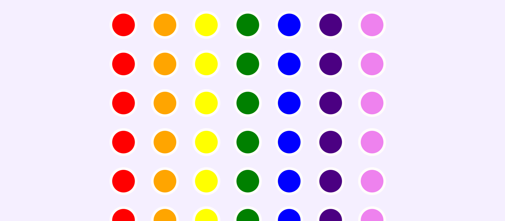

#### Abstract

**_Link to the website:_**
https://rainbow-drums.herokuapp.com/

Rainbow drums is an online drum machine for kids. Each color represents a different common drum sound like for example kick or snare. By pressing buttons kids can mix a track, which is then played in the loop. It is also possible to change the tempo and the loudness of the track!

#### Concept

It all started with a really simple drum machine project that I had to build for the web development bootcamp. It was a basic drumkit, when you press a button or a key it plays the coressponding sound.

I wanted to develop that project father and create some fun experience for kids that have no previous music training. I got inspiration from these websites, which are cicular sequencers http://sequ.timpulver.de/ and http://keyuguo.net/MoolodyWebVersion/

I liked the idea of placing sounds on the grid and letting the user to arrange the sounds themselves and that is how I decided to create my own sound mixer and sound visualizer. Unfortunatly I failed at the vizualization part.

#### Implementation

First I designed the buttons and changed the color scheme to a rainbow color scheme to have some kind of “metaphorical meaning”. I somehow came up with this idea in the shower, it gave me direction to go and some room for thought for the visualization part of the project. After thinking of all the possible ways to design and arrange the music buttons and to play them, I made the decision to have a grid of colorful buttons where the column would represent a particular sound group and the track would be played row by row.

So with this plan in my mind I divided project into four parts:

1. user can select the buttons that would be played

2. playing the buttons user selected in a particular order

3. adding animation to the active buttons

4. gui with a play button, tempo and volume sliders

### PART ONE:

**_Making buttons (selected by user) active_**

- first of all, in order to practice object oriented programming, created a rainbowSound class. Now i need to use lots of this and this and this and this!

- Added event listener for click to each button, with a call back function which refers to the object method ativeButton(). In that method i add the class toggle “pressed”. this they I know which button has been pressed.

- added shadow to the button, so that the users know which button they have pressed

- added some css to button hover, so that user know that the button can be clicked

### PART TWO:

**_Playing the active buttons_**

- In order to move column by column, created a loop function. I'm increasing index and select a button with the given index in the each row for every step up to 8, with an interval of some milliseconds.

- The interval represents how fast the columns change or in other words beats per second. Decided to give a user a control of that value. Need to do a conversation from seconds to milliseconds.

- To play asound, I used a simple "if" logic, if the button is pressed and if this sound is that particular sound than play this sound. Had a problem that if same buttons would be played one after another there will be a lag and even when the sound is not selected it would still play. It turned out that I had to reset the sound before I play it, with sound.currentTime() function, so that it wont play till the end.

### PART THREE:

**_Animation!_**

- I did not really know how to create animations in vanilla javascript without p5, so decided to go with something simple.
  Added animation to the raw of buttons playing with .style.animation. Created a pulse effect animation with keyframes in css.

- Had a problem here that the animation would only run once. After some research found out that the style of animation is added to the button, so we have to delete the style before we run the row again. You can do it with animationend event, which occurres when css animation has completed. So for each button when the animation end I need to remove it from the style with setting it to nothing (reset it).

### PART FOUR:

**_GUI_**

- Added a play button, so that the loop function starts when you press play. For that used an even listener for a click. Styled it with the icons "play" and "pause" from font awesome.

- Fixed a problem of play button. If you press the button again and again it stacks tracks on top of each other and sums the intervals instead of just stopping and playing the sound again. I had to add some "if playing" logic.

- Added a tempo slider. After some research I found that there are call back functions type input and type change. The first one is updating constantly and I used it to change the text, which shows the current tempo. The second one is updating only when the value is changed and it is better for actually changing the tempo (to not to invoke a fuction many times while changing slider).

- Fixed the problem of a tempo slder. When I would change the tempo it would start playing the sound even if the sound is not on. I had to add some if logic to check if the play button is pressed.

- Following the same logic added a volume slider. I couldn't find the better solution than changing the volume of each playing sound with audio method .volume. It would be better to change the volume of all sounds together though.

### Final Part:

In the end I did some rebrending to make design more playful, refactored the code, prepared the app for heroku with express and ejs and sucessfully deployed it to heroku. Done!

#### Results

#### Project Reflection & Discussion

I'm pretty happy with the results. I think a did a good job of putting the programming skills I learned in the first year of ctech, creative coding class and javascript knowledge from the web development bootcamp into practice. A year ago I would never be able to build something like this from scratch.

Honestly, when I came up with the idea, in my mind it was much bigger and better. I am a bit dissapointed in myself that I move slowly, because I could implement only a part of it in these two weeks. But I guess the better I become at programming, the faster I would move. So I'm waiting patiently and take baby steps.

There are so many things I could add to this project and the main thing is the real time **_sound vizualizaion_**. I wanted to use my creative coding knowledge and vizualize audio with vanilla javascript. But I got stucked in the beginning and after few days of research I couldnt figure out how to access the users speakers. I could only find info on accessing user's mic. Then I changed the plan and decided to record the track by saving the information which active buttons were played at which time into an array. The plan was to use this array to recreate the song for not only vizualization but also for saving, playing back and sharing the track. I tried my best, but in the end failed. I guess if I would have more time, in the end I would make it. And I'm quite said that because of getting stucked in the beginning, I didn't get to the vizualization part.

Other ideas for future work:

- different sounds (the sounds i used are the boring one from the web development bootcamp), do a collobaration with a sound artist

- or digital sounds, using Tone.js library. This way I would have full control over music and can for example add presets for making sounds more jazzy, hip hop and so on and also add filters or echos

- different visual representation, similar to this amazing website https://soundscape.world/

- some fancy machine learning that can help you create good tracks

-

#### Lessons Learned

"Sometimes when you get stuck on one problem for days, just skip it and move forward. Come back to it in the end if you have time."

Ellina Nurmukhametova
